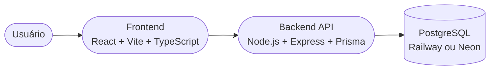

## 🔗 Diagrama C4 — Nível Container

```mermaid
graph LR
    User([Usuário])
    Frontend([Frontend<br>React + Vite + TypeScript])
    Backend([Backend API<br>Node.js + Express + Prisma])
    Database[(PostgreSQL<br>Railway ou Neon)]
    User --> Frontend
    Frontend --> Backend
    Backend --> Database
```
