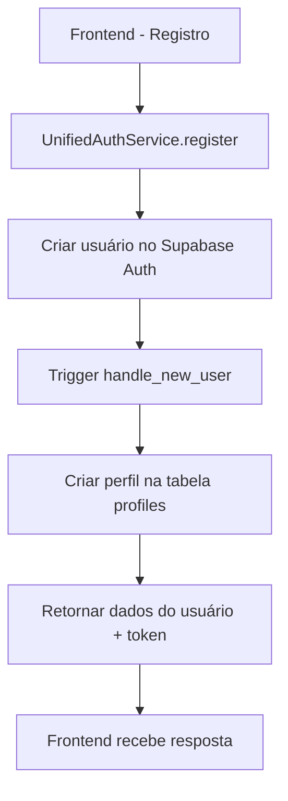

# Solução Unificada de Autenticação - MentorIA

## Problema Identificado

O sistema estava usando dois bancos de dados diferentes:
- **SQLite local** (via Sequelize) - para a tabela `profiles`
- **Supabase** - para autenticação (`auth.users`)

Isso causava inconsistências onde:
1. Usuários eram criados no Supabase Auth
2. Mas perfis não eram criados automaticamente na tabela `profiles`
3. O sistema tentava usar SQLite local para perfis
4. Havia dois fluxos diferentes de registro

## Solução Implementada

### 1. Migração para Supabase Unificado

**Objetivo**: Usar apenas o Supabase para auth + profiles

**Arquivos Criados/Modificados**:
- `src/services/unified-auth.service.ts` - Serviço unificado
- `src/controllers/unified-auth.controller.ts` - Controller unificado
- `src/routes/unified-auth.routes.ts` - Rotas unificadas
- `docs/supabase-schema-updated.sql` - Schema atualizado
- `migrate-to-supabase.js` - Script de migração
- `test-unified-auth.js` - Script de teste

### 2. Fluxo de Registro Unificado



### 3. Estrutura do Banco de Dados

**Tabela `profiles` no Supabase**:
```sql
CREATE TABLE profiles (
  id UUID REFERENCES auth.users(id) ON DELETE CASCADE PRIMARY KEY,
  email TEXT UNIQUE NOT NULL,
  name TEXT NOT NULL,
  birth_date DATE,
  institution TEXT,
  created_at TIMESTAMP WITH TIME ZONE DEFAULT NOW(),
  updated_at TIMESTAMP WITH TIME ZONE DEFAULT NOW()
);
```

**Trigger Automático**:
```sql
CREATE OR REPLACE FUNCTION handle_new_user()
RETURNS TRIGGER AS $$
BEGIN
  INSERT INTO profiles (id, email, name, birth_date, institution)
  VALUES (
    NEW.id,
    NEW.email,
    COALESCE(NEW.raw_user_meta_data->>'name', 'Usuário'),
    CASE 
      WHEN NEW.raw_user_meta_data->>'birth_date' IS NOT NULL 
      THEN (NEW.raw_user_meta_data->>'birth_date')::DATE
      ELSE NULL
    END,
    NEW.raw_user_meta_data->>'institution'
  );
  RETURN NEW;
END;
$$ LANGUAGE plpgsql SECURITY DEFINER;
```

### 4. Políticas de Segurança (RLS)

**Políticas Implementadas**:
- Usuários autenticados podem ver seus próprios perfis
- Usuários autenticados podem atualizar seus próprios perfis
- Service role pode inserir perfis (para o trigger)
- Todas as operações são protegidas por RLS

### 5. Endpoints da API

**Rotas Públicas**:
- `POST /api/auth/register` - Registro de usuário
- `POST /api/auth/login` - Login
- `POST /api/auth/forgot-password` - Reset de senha

**Rotas Protegidas**:
- `GET /api/auth/me` - Dados do usuário atual
- `PUT /api/auth/profile` - Atualizar perfil
- `POST /api/auth/logout` - Logout

**Rotas de Debug**:
- `GET /api/auth/profiles` - Listar todos os perfis (remover em produção)

## Como Implementar

### 1. Executar Migração de Dados

```bash
# Migrar dados do SQLite para o Supabase
node migrate-to-supabase.js
```

### 2. Atualizar Schema do Supabase

Execute o script `docs/supabase-schema-updated.sql` no SQL Editor do Supabase.

### 3. Testar o Sistema

```bash
# Testar o sistema unificado
node test-unified-auth.js
```

### 4. Verificar Configuração

Certifique-se de que as variáveis de ambiente estão configuradas:
```env
SUPABASE_URL=sua_url_do_supabase
SUPABASE_ANON_KEY=sua_chave_anonima
SUPABASE_SERVICE_ROLE_KEY=sua_chave_service_role
FRONTEND_URL=http://localhost:3000
```

## Vantagens da Solução

### ✅ Benefícios
1. **Consistência**: Tudo em um só lugar (Supabase)
2. **Simplicidade**: Um único fluxo de autenticação
3. **Confiabilidade**: Trigger automático garante criação de perfis
4. **Segurança**: RLS implementado corretamente
5. **Escalabilidade**: Supabase é altamente escalável
6. **Manutenibilidade**: Código mais limpo e organizado

### 🔧 Melhorias Implementadas
1. **Logs Detalhados**: Melhor observabilidade
2. **Tratamento de Erros**: Fallbacks para casos de falha
3. **Validações**: Validações robustas
4. **Testes**: Scripts de teste automatizados
5. **Documentação**: Documentação completa

## Próximos Passos

### 1. Limpeza
- Remover arquivos antigos (SQLite, serviços antigos)
- Remover rotas antigas
- Limpar dependências não utilizadas

### 2. Frontend
- Atualizar frontend para usar os novos endpoints
- Implementar tratamento de tokens do Supabase
- Atualizar tipos TypeScript

### 3. Produção
- Configurar variáveis de ambiente de produção
- Implementar monitoramento
- Configurar backups automáticos

### 4. Segurança
- Revisar políticas RLS
- Implementar rate limiting
- Configurar auditoria de logs

## Troubleshooting

### Problema: Trigger não cria perfil
**Solução**: Verificar se o trigger está ativo e se as políticas RLS permitem inserção.

### Problema: Erro de permissão
**Solução**: Verificar se as chaves do Supabase estão configuradas corretamente.

### Problema: Token inválido
**Solução**: Verificar se o token está sendo enviado corretamente no header Authorization.

## Conclusão

A solução unificada resolve o problema principal de inconsistência entre bancos de dados e garante que todos os usuários tenham perfis criados automaticamente. O sistema agora é mais robusto, escalável e fácil de manter. 